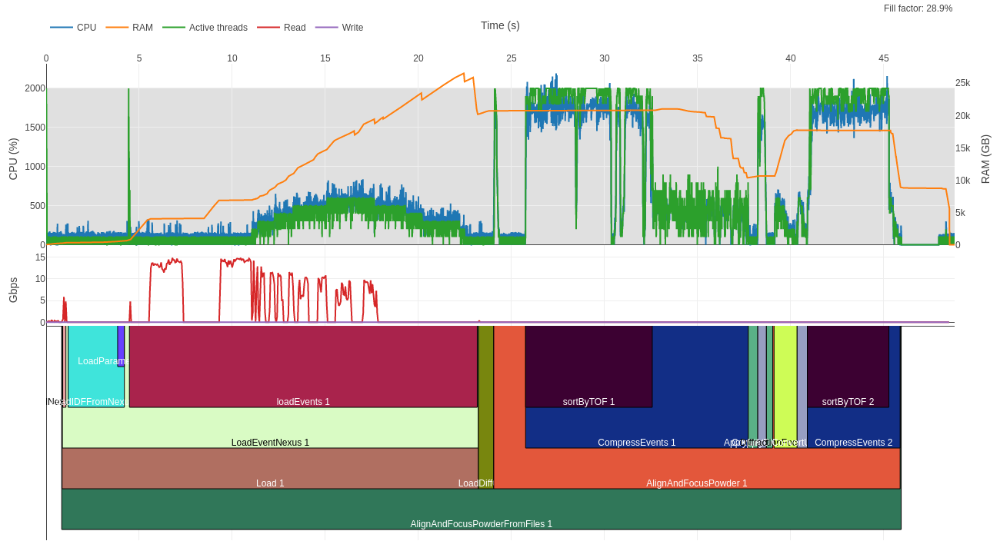

# mantid-profiler

Use [psrecord](https://github.com/astrofrog/psrecord) and [Plotly.js](https://plot.ly/javascript/) to profile a Mantid workflow.

It monitors CPU and RAM usage, and reports the time span of each algorithm (currently, only algorithms are recorded).



## Usage

To profile the `SNSPowderReduction.py` workflow:
```
python SNSPowderReduction.py & mantidprofiler $!
```
The script attaches to the last spawned process, so you can also use the profiler if you are working with `MantidPlot`:
```
./MantidPlot & mantidprofiler $!
```

## Requires

- `psutil`
- You need to build Mantid with the `-DPROFILE_ALGORITHM_LINUX=ON` `CMake` flag to get the timing output from the algorithms.

## Results

After running on the `SNSPowderReduction.py` workflow, the profiler produces a `profile.html` file to be viewed with an internet browser.


You can interact with a demo profile [here](http://www.nbi.dk/~nvaytet/SNSPowderReduction_12.html).

**Controls:**

- Mouse wheel to zoom (horizontal zoom only)
- Left click to select zoom region (horizontal zoom only)
- Double-click to reset axes
- Hold shift and mouse click to pan

## More options for mantid-profiler.py

- `-h`, `--help`          show this help message and exit
- `--outfile OUTFILE`    name of output html file (default: `profile.html`)
- `--infile INFILE`      name of input file containing algorithm timings (default: `algotimeregister.out`)
- `--logfile LOGFILE`    name of output file containing process monitor data (default: `mantidprofile.txt`)
- `--diskfile DISKFILE`  name of output file containing process disk usage data (default: `mantiddisk.txt`)
- `--interval INTERVAL`  how long to wait between each sample (in seconds). By default the process is sampled as often as possible. (default: None)
- `--noclean`             remove files upon successful completion (default: False)
- `--height HEIGHT`      height for html plot (default: 800)
- `--bytes`               Report disk speed in GBps rather than Gbps (default: False)
- `--mintime MINTIME`    minimum duration for an algorithm to appear inthe profiling graph (in seconds). (default: 0.1)

## Similar projects

[viztracer](https://github.com/gaogaotiantian/viztracer) creates similar information for generic python software

## Related Documentation

- [Mantid's AlgoTimeRegister](https://github.com/mantidproject/mantid/blob/main/docs/source/api/python/mantid/api/AlgoTimeRegister.rst) explains the under-the-hood of the timing mechanism.
- [Mantid developer profiler documentation](https://github.com/mantidproject/mantid/blob/main/dev-docs/source/AlgorithmProfiler.rst) provides additional information as to how it works with mantid.
- [Mantid User Properties File](https://github.com/mantidproject/mantid/blob/main/docs/source/concepts/PropertiesFile.rst#algorithm-profiling-settings) has some fields to be noted.


## Contact

Neil Vaytet, European Spallation Source

[](https://www.gnu.org/licenses/gpl-3.0)
[](https://results.pre-commit.ci/latest/github/mantidproject/mantid-profiler/main)
